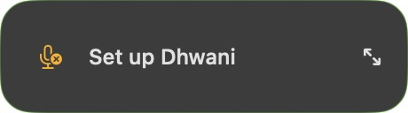
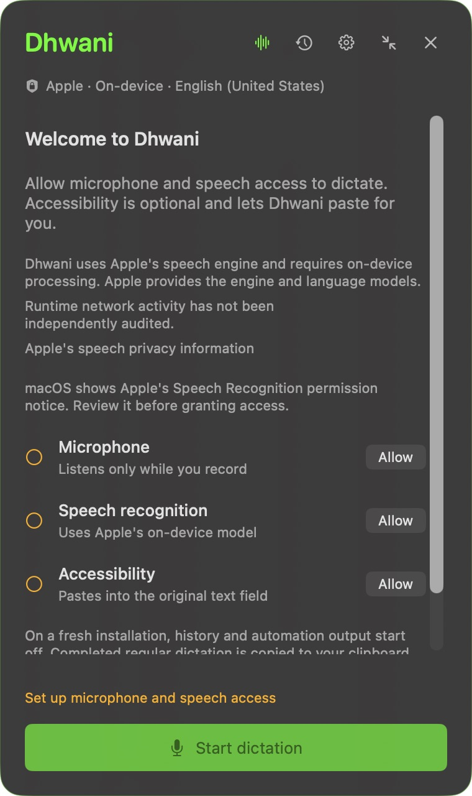

# Lokaah Talky

**Voice typing for your Mac.**

Press **Option-Space**, speak, then press it again to finish.
Talky turns your speech into text, copies it, and can paste it into the text field where you started.
It uses Apple's speech engine and requires an available on-device language model.

## Download and install

**There is no public installer yet. Talky is in early testing.**

The planned installation is:

1. Download the Talky `.dmg`.
2. Open it and drag **Lokaah Talky** into **Applications**.
3. Open Talky and allow Microphone and Speech Recognition access.

That installer will not require Xcode or terminal commands.
It has not been released yet. The current private test package is a ZIP.
An unnotarized download may also need **Open Anyway** in macOS Privacy & Security.

**[Volunteer to try the early beta](docs/EARLY-TESTING.md)**

For Apple Silicon Macs, M1 or newer. The build targets macOS 14 or newer; live dictation on macOS 14 still needs testing.
Windows, Linux, and Intel Macs are not supported by this build.

## How you use it

1. Click the text field you want to write in.
2. Press **Option-Space** to start speaking, then again to finish.
3. Talky copies the text. With Accessibility permission, it can also paste for you.

Without Accessibility, press **Command-V** yourself.
If you switch apps or text fields during dictation, automatic paste is withheld.
Press **Option-Escape** to cancel.

Talky stays in a small floating widget. Expand it for the transcript and settings.
You can choose a speech language, add vocabulary hints, and enable local history.
Auto-send starts off; turning it on can submit a message or run a terminal command.

See the setup screen

Actual interface captured on 7 October 2026 from an isolated app copy, before recording permissions were granted.
[Capture details](docs/SCREENSHOTS.md).

## Privacy and local storage

Apple supplies the recognition engine and language models.
Talky's source requires on-device recognition and has no network-recognition fallback.
This relies on Apple's API behavior; runtime network activity has not been independently audited.
Read the [Apple speech and privacy disclosure](docs/PRIVACY.md) before granting access.

Regular dictation replaces your clipboard. Other apps can read that text.
History, the latest-transcript file, and launch at login start off on a fresh installation.
Upgrades keep your saved preferences. [Storage, retention, and deletion details](docs/LOCAL-STORAGE.md).

## Build and run

**For developers:** [BUILD.md](BUILD.md) covers building from source with Xcode or Command Line Tools.
GitHub's **Source code** archives contain developer files, not an installable app.

## Help improve Talky

[Test the app](docs/EARLY-TESTING.md), [report a bug](https://github.com/Venkat-RJ/lokaah-talky/issues/new?template=bug_report.yml), or [contribute a fix](CONTRIBUTING.md).
We need help with installation, permission recovery, dictation, and pasting into everyday apps.

Live dictation, cross-app paste, privacy observations, and installation on a fresh Mac still need acceptance testing.
No recognition-accuracy or reliable capture-length claim has been established.
See [completed checks](docs/VERIFICATION.md), the [release checklist](PRODUCT.md#release-readiness), and [test instructions](TESTING.md).
Report vulnerabilities [privately](SECURITY.md).

[MIT licensed](LICENSE), copyright 2026 Lokaah. Dependencies retain their own licenses, including the optional [Remotion video toolchain](https://www.remotion.dev/license).
The old `v1.0.0` build and `assets/demo.*` are historical material.
