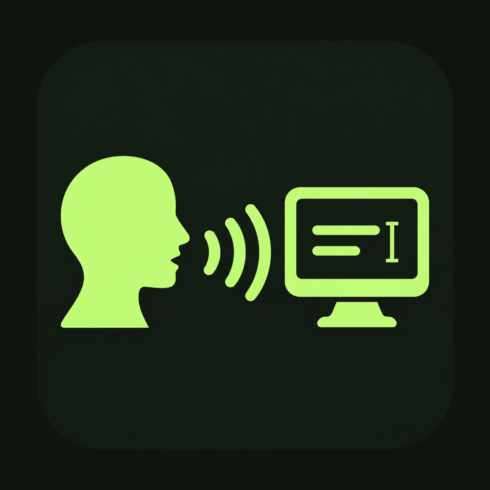

<p align="center"></p>

# Lokaah Talky

Voice dictation for macOS, in a small floating widget.

Press **Option-Space**, speak, then press it again to finish.
Talky copies the transcript to the clipboard and can paste it into the app and text field where you started.

Talky uses Apple's system Speech framework and requires on-device recognition.
It requires a local speech model for the language you select.
Apple provides the recognition engine and models.
See [speech recognition and privacy](docs/PRIVACY.md) for the permission notice and verification limits.

The project is MIT licensed and available as a source preview.
Build it locally for now.
Live dictation, cross-app paste, and a signed, notarized download still need verification.
See the [release checklist](PRODUCT.md#release-readiness) and [checks completed so far](docs/VERIFICATION.md).

A [free unnotarized beta workflow](docs/UNNOTARIZED-BETA.md) is available for preparing a test candidate.
A public beta download still needs live acceptance and clean-Mac installation testing.
This route includes a macOS approval step described in [the beta installation guide](docs/BETA-INSTALL.md).

## What it does

- A floating widget with no Dock icon.
- Live transcript text, with recognition sessions renewed during longer captures.
- Clipboard copy and optional paste into the original app and text field.
- **Option-Escape** to cancel without delivery or storage.
- Language selection and local vocabulary hints.
- Optional history with search, copy, export, deletion, and retention controls.

Accuracy and capture length need testing with real voices, languages, microphones, and environments.
We have not published an accuracy benchmark.
The [synthetic corpus and evaluator](test/benchmarks/README.md) are ready for those tests.

## Build and run

Use **Apple Silicon** with **Xcode 26 or newer**, or compatible standalone Command Line Tools.
The deployment target is **macOS 14**.
Startup has passed on macOS 14; live dictation on that version is still pending.

Clone the repository:

```bash
git clone https://github.com/Venkat-RJ/lokaah-talky.git
cd lokaah-talky
```

For a separate local build, use standalone Command Line Tools:

```bash
./build-local.sh
./build-local.sh --release --adhoc --output-dir build/local
```

The first command creates an unsigned Debug bundle at `build/local/Lokaah Talky.app`.
The second creates an optimized, ad-hoc signed bundle for local testing.
Neither command installs or launches it.
Ad-hoc builds may need new permission grants after rebuilding.

For local installation with a stable development identity:

```bash
./setup-cert.sh
./reinstall.sh --build
```

The setup script changes your login keychain.
The installer builds, signs, replaces the installed app, and launches it.
Read [BUILD.md](BUILD.md) before running them.
You can also open `Lokaah Talky.xcodeproj` in Xcode.

Local signing is for development.
The [unnotarized beta](docs/UNNOTARIZED-BETA.md) and [Apple-notarized release](docs/BINARY-RELEASE.md) have separate preparation steps and require acceptance of the final app archive.

## Permissions and everyday use

Allow **Microphone** and **Speech Recognition** to dictate.
Allow **Accessibility** if you want automatic paste.
Without Accessibility, use Command-V to paste the copied text yourself.

1. Focus the app and text field where you want the text.
2. Press **Option-Space**, or use the widget, to start.
3. Speak, then press **Option-Space** again to finish.
4. Paste with **Command-V** if automatic paste is unavailable or blocked.

Regular dictation replaces the previous clipboard contents.
Automatic paste requires the original app and focused text field to still match.
If you change either, the transcript stays on the clipboard for you to paste.

Expand the widget to see the transcript and controls.
Settings contains language, vocabulary, storage, and launch-at-login options.

Auto-send can submit a chat message or run a terminal command.
It starts off on a fresh installation, and your choice is saved.
Enable it only when you want Return sent to the current destination.

## Privacy and local storage

Talky's source requires local processing for every recognition request and has no network-recognition fallback.
It refuses to record if the selected recognizer cannot process speech on-device.
These checks rely on Apple's documented API behavior.
Runtime network activity and Apple's broader data handling have not been independently audited.

Talky's source is MIT licensed; Apple's recognition engine is proprietary.
Read [the privacy disclosure](docs/PRIVACY.md) and the linked Apple policies before granting Speech Recognition access.

Other apps can read clipboard contents, and the receiving app can use text pasted into it.

History, the latest-transcript automation file, and launch at login are **off on a fresh installation**.
Upgrades preserve saved preferences and existing launch-at-login registration.

If you enable history, keep records for 1, 7, or 30 days, or until you delete them.
Talky checks retention at startup, when history settings change, and after saving a dictation.
History lives in `~/.talky/voice_history/` as unencrypted files with owner-only permissions.

Turning history off stops new saves and leaves existing records available.
Use **History** to search, copy, export, or delete saved dictations.
Deleting history does not clear the clipboard or remove exported files.

The optional latest-transcript file is `~/.talky/voice_input.txt`.
Turning its setting off removes that file.

Scripts running as your user account can control Talky through its command file.
Only use scripts you trust.
The commands and isolated test results are described in [TESTING.md](TESTING.md).

## Contribute

Start with [CONTRIBUTING.md](CONTRIBUTING.md).
Useful work includes permission recovery, safe delivery, accessibility, local languages, and live testing.

- [BUILD.md](BUILD.md): build steps, installation, and architecture.
- [TESTING.md](TESTING.md): automated checks and live test steps.
- [PRODUCT.md](PRODUCT.md): user needs, priorities, and release checklist.
- [SECURITY.md](SECURITY.md): private vulnerability reporting.

The project source is [MIT licensed](LICENSE), copyright 2026 Lokaah.
Dependencies keep their own licenses.
The optional Remotion video toolchain uses [Remotion's license](https://www.remotion.dev/license).

The old `v1.0.0` build and files under `assets/demo.*` predate the current work.
They are historical material, not evidence of today's app behavior.
